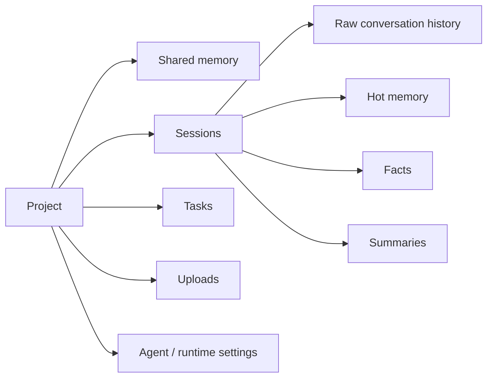
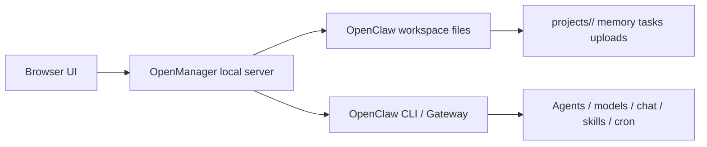
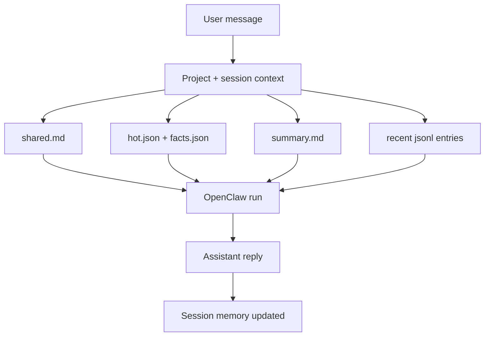

# OpenManager

[中文说明](./README.zh-CN.md)

<p align="center">
  
</p>

<p align="center">
  
  
  
  
  
</p>

<p align="center">
  A local-first workspace UI built for OpenClaw, designed for multi-project work, persistent memory, and clean session boundaries.
</p>

<p align="center">
  <a href="#in-one-minute"><strong>Deploy in 1 minute</strong></a> ·
  <a href="#one-click-prompt-for-openclaw"><strong>OpenClaw deploy prompt</strong></a> ·
  <a href="./CONTRIBUTING.md"><strong>Contributing</strong></a> ·
  <a href="./docs/frontend-architecture.md"><strong>Frontend architecture</strong></a> ·
  <a href="./README.zh-CN.md"><strong>中文说明</strong></a>
</p>

OpenManager is a local-first workspace UI built for OpenClaw.

It gives OpenClaw users a durable project layer on top of normal chat:

- one project for one long-running workspace
- one session for one work thread
- one place for memory, tasks, uploads, and agent bindings

If you often work across multiple projects, return to the same context over many days, or hate re-explaining background every time you continue, OpenManager is built for that.

<p align="center">
  
</p>

## Why OpenManager

OpenManager treats:

- a project as the workspace boundary
- a session as the conversation boundary
- an agent as the execution boundary

That model is a good fit when you are:

- running several OpenClaw projects in parallel
- revisiting the same project across many days
- switching between planning, execution, debugging, and release work
- trying to keep memory and files tied to the right project

## In One Minute

### Requirements

- Node.js 20+
- OpenClaw installed and already working in your shell

### Start locally

```bash
git clone https://github.com/Adkid-Zephyr/OpenManager.git
cd OpenManager
npm install
npm start
```

Then open:

```text
http://127.0.0.1:3456/
```

Manual:

```text
http://127.0.0.1:3456/manual.html
```

### What starts

- A local web UI
- A local Node.js API
- Runtime data inside your OpenClaw workspace, not in the repo
- OpenClaw-backed features for agents, models, chat, Skills, and Cron

## One-Click Prompt For OpenClaw

If you want OpenClaw, Codex, or another coding agent to deploy this project for you, give it this prompt:

```text
Clone https://github.com/Adkid-Zephyr/OpenManager.git, install dependencies, start the local server, verify http://127.0.0.1:3456/ and http://127.0.0.1:3456/manual.html both load, then tell me how to keep it running and how to reopen it later.
```

If you want a more guided setup, use this version:

```text
I want to deploy OpenManager locally for daily OpenClaw use. Clone https://github.com/Adkid-Zephyr/OpenManager.git, check that OpenClaw is available in my shell, install dependencies, start the app, verify the UI and manual page both load, explain where runtime data will be stored, and give me the exact command to start it again next time.
```

## What You Get

- Multi-project local workspace management
- Shared memory at the project level
- Session-level memory layers for long-running conversations
- Task tracking and file uploads per project
- One-click binding to dedicated OpenClaw agents
- Optional local Codex execution for project workspaces
- Cron and Skills panels for OpenClaw power users
- A local manual built into the app

## Product Tour

<table>
  <tr>
    <td width="50%" valign="top">
      <strong>Shared memory</strong><br>
      Project goals, scope, constraints, and long-lived working context.
      <br><br>
      
    </td>
    <td width="50%" valign="top">
      <strong>Session memory</strong><br>
      Ongoing conversation state, recent conclusions, and next-step continuity.
      <br><br>
      
    </td>
  </tr>
  <tr>
    <td width="50%" valign="top">
      <strong>Skills panel</strong><br>
      Check what is available, disabled, or missing before serious project work.
      <br><br>
      
    </td>
    <td width="50%" valign="top">
      <strong>Cron panel</strong><br>
      Turn recurring review, reminder, or inspection steps into repeatable workflows.
      <br><br>
      
    </td>
  </tr>
</table>

## Screenshots

More product screenshots are available in [`docs/screenshots/`](./docs/screenshots/).

## Contributing

If you want to help improve OpenManager, start here:

- [`CONTRIBUTING.md`](./CONTRIBUTING.md)
- [`docs/project-map.md`](./docs/project-map.md)
- [`docs/frontend-architecture.md`](./docs/frontend-architecture.md)
- [`docs/regression-checklist.md`](./docs/regression-checklist.md)

The current refactor direction is behavior-preserving:

- keep the existing UI familiar
- keep the existing interaction model familiar
- improve maintainability underneath

## How It Works

### Product model



### Runtime architecture



### Chat and memory flow



## What You Get

## Recommended User Flow

1. Create a project for a long-running theme.
2. Fill in shared memory with goal, scope, constraints, and next steps.
3. Create separate sessions for planning, implementation, debugging, or release.
4. Attach tasks and uploads to the same project instead of scattering them across tools.
5. Bind a dedicated agent when the project becomes serious and long-lived.

Recommended naming patterns:

- Project names: `官网改版`, `数据看板`, `内容选题库`, `客户交付 Alpha`
- Session names: `需求梳理`, `接口联调`, `发布收尾`, `问题排查`

## OpenClaw Integration

OpenManager depends on the OpenClaw CLI for several features:

- list and create agents
- chat through gateway agents
- list models
- manage Skills
- manage Cron jobs

OpenManager is local-first, but some actions have global side effects:

- Skills toggles write to your OpenClaw user config
- Cron jobs are created in your OpenClaw runtime

That behavior is intentional, but it should be understood before use.

## Environment Variables

- `PORT`
  Default: `3456`

- `HOST`
  Default: `127.0.0.1`

- `OPENMANAGER_WORKSPACE_DIR`
  Optional override for where project runtime data lives

- `OPENCLAW_WORKSPACE_DIR`
  Legacy-compatible override if you already manage your workspace that way

- `OPENCLAW_HOME`
  Optional override for the OpenClaw home directory

- `OPENMANAGER_ALLOWED_ORIGINS`
  Optional comma-separated list of extra origins allowed to call the local API

If no workspace override is provided, OpenManager falls back to:

```text
~/.openclaw/workspace
```

## Project Data Layout

Runtime data is stored outside the repo in your OpenClaw workspace:

```text
projects/<project>/
├── .project.json
├── memory/
│   ├── shared.md
│   ├── session-<id>.meta.json
│   ├── session-<id>.jsonl
│   ├── session-<id>.hot.json
│   ├── session-<id>.facts.json
│   ├── session-<id>.summary.md
│   └── session-<id>.md
├── tasks/
│   └── tasks.json
└── uploads/
```

The initial `shared.md` template is intentionally guided so new users can fill in:

- one-sentence goal
- success criteria
- current scope
- key context
- working agreements
- next steps

## Privacy And Safety

- This repo is designed to stay free of personal runtime data
- Project conversations, uploads, and memory files live in the workspace, not in the repo
- The default server host is `127.0.0.1` to avoid exposing the UI on your LAN by accident
- Browser API access is restricted to the local OpenManager origin by default, which reduces the risk of arbitrary websites calling your local API while the app is running
- The default local workflow at `http://127.0.0.1:3456/` is not affected by that restriction
- If you intentionally serve the UI from another origin, set `OPENMANAGER_ALLOWED_ORIGINS` accordingly
- Keep the default `HOST=127.0.0.1` unless you intentionally trust the network and understand the exposure

## Troubleshooting

### The page loads but project actions fail

Check whether OpenClaw works in the same shell:

```bash
openclaw --help
```

### I want OpenManager data in another workspace

Start it with:

```bash
OPENMANAGER_WORKSPACE_DIR=/your/path npm start
```

### I use a custom reverse proxy or origin

Allow that origin explicitly:

```bash
OPENMANAGER_ALLOWED_ORIGINS=https://your-domain.example npm start
```

### I want it reachable from my LAN

You can bind another host, but that is no longer the safest default:

```bash
HOST=0.0.0.0 npm start
```

Only do this when you understand the network exposure.

## Scripts

- `npm start`
  Start the app

- `npm run dev`
  Start the backend directly

- `npm run sync:compat`
  Sync `frontend/*` to compatibility entry files in the repo root

- `npm test`
  Run the release-minimum verification suite: production build, smoke test, and browser regression coverage

- `npm run regression`
  Run the Playwright-based browser regression suite for composer behavior, upload preview, and run controls

## Repository Structure

```text
openmanager/
├── app.html
├── api.js
├── manual.html
├── frontend/
│   ├── index.html
│   ├── api.js
│   └── manual.html
├── backend/
│   ├── context.js
│   ├── server.js
│   ├── lib/
│   └── routes/
├── docs/
├── scripts/
├── cli.js
├── USER_GUIDE.md
├── SEPARATION_NOTES.md
└── SKILL.md
```

## Current Limitations

- No multi-user auth layer; this is a local tool
- Cron and Skills depend on a functioning OpenClaw CLI environment
- Some convenience actions still assume a desktop environment

## Docs

- [中文说明](./README.zh-CN.md)
- [USER_GUIDE.md](./USER_GUIDE.md)
- [Project Map](./docs/project-map.md)
- [SEPARATION_NOTES.md](./SEPARATION_NOTES.md)
- [SKILL.md](./SKILL.md)
- [Release Notes v0.1.0](./docs/release-v0.1.0.md)
