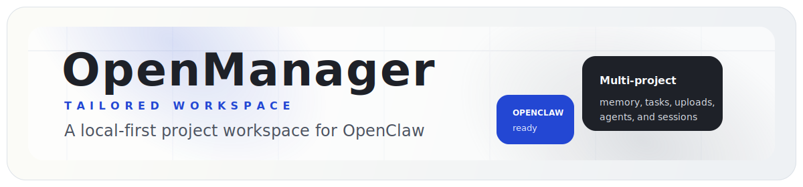
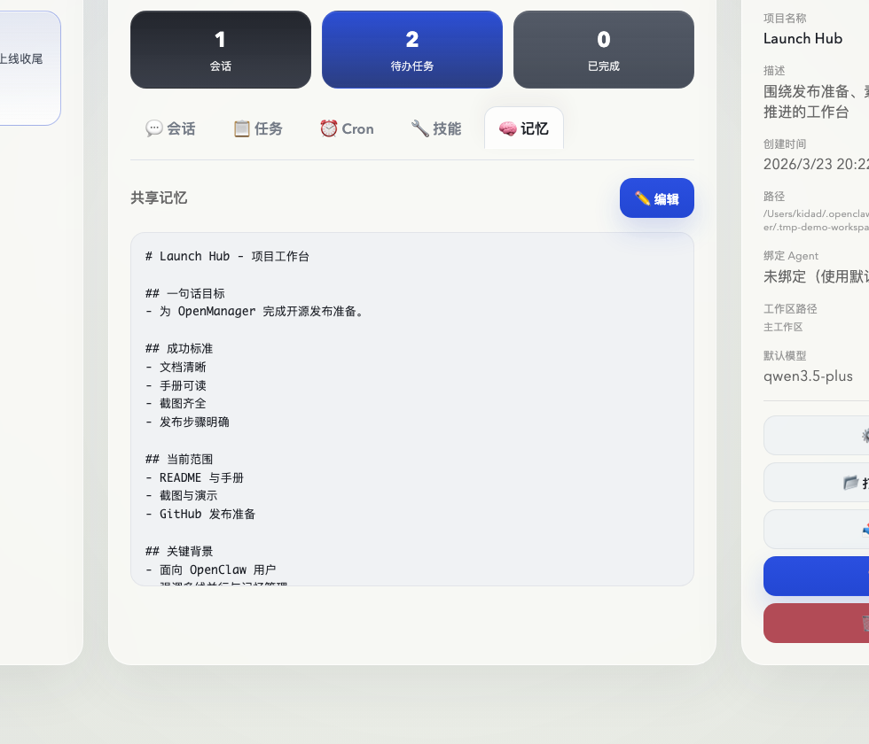
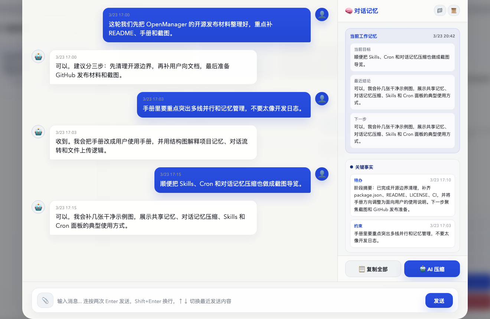
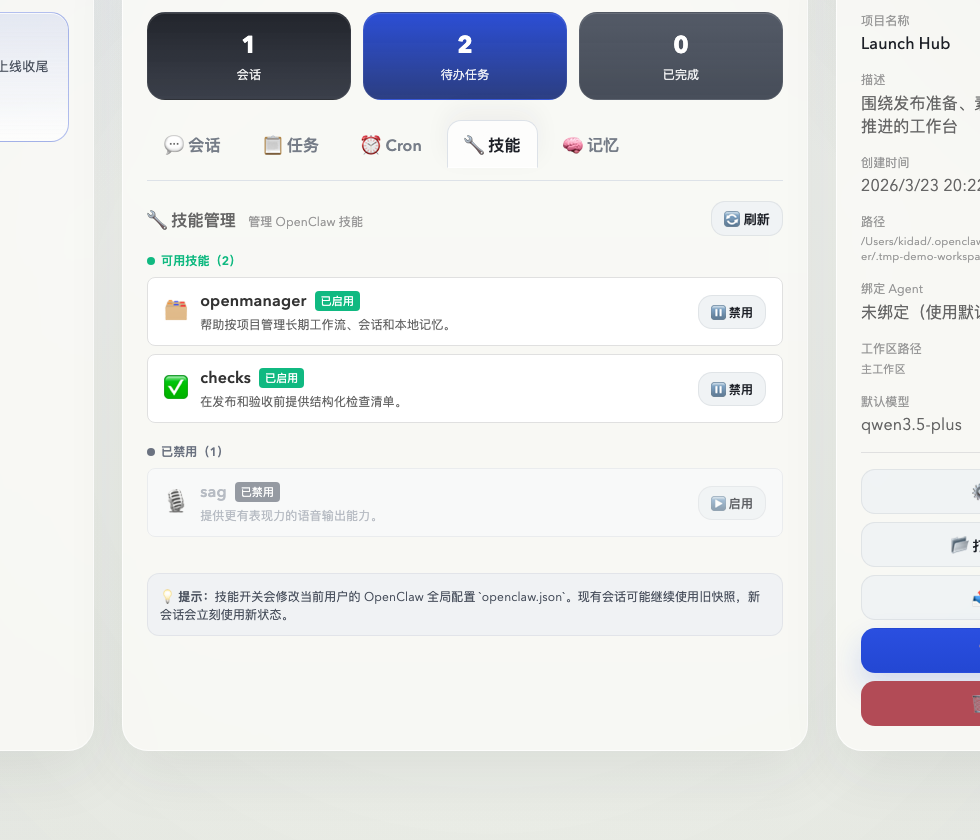
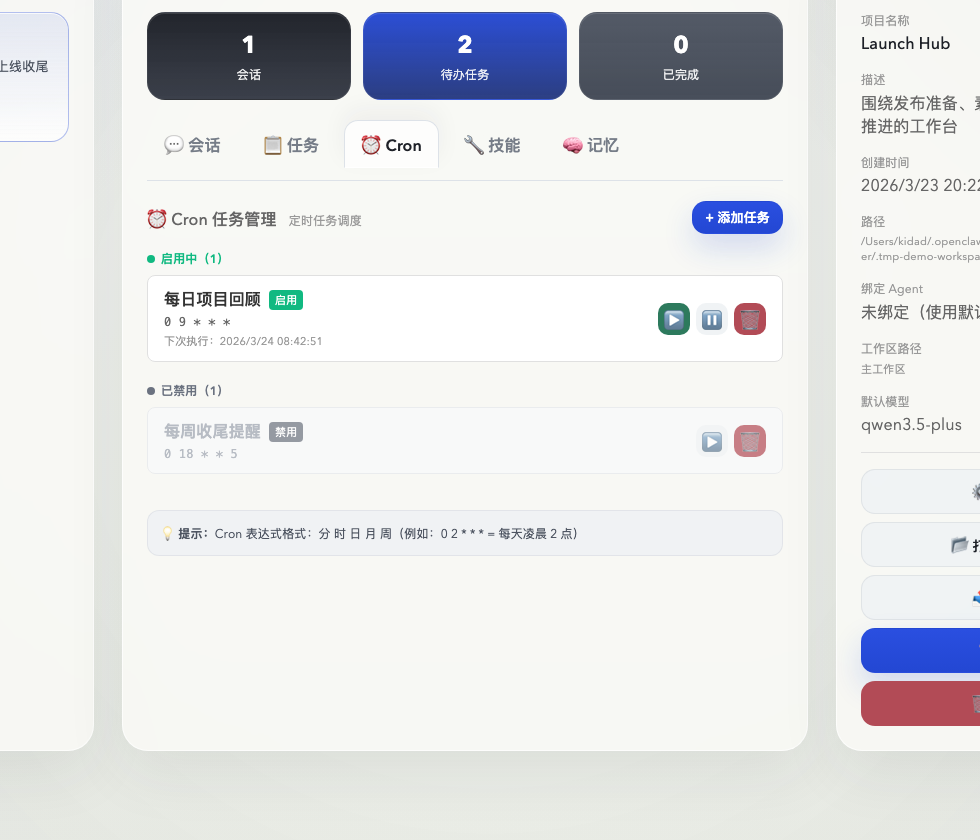
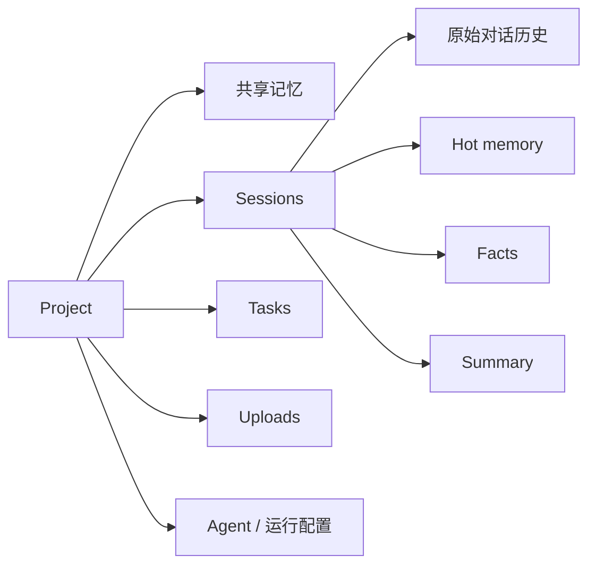
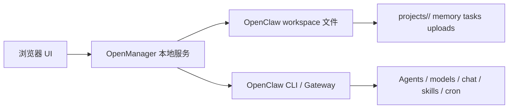
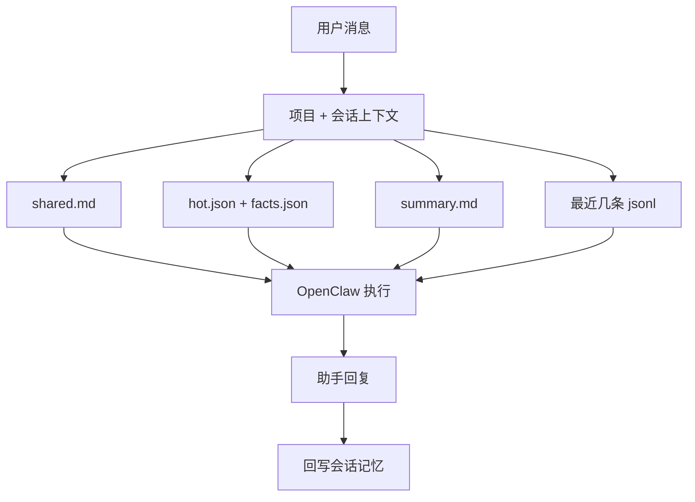

# OpenManager

[English README](./README.md)

<p align="center">
  
</p>

<p align="center">
  
  
  
  
  
</p>

<p align="center">
  一个为 OpenClaw 设计的本地优先项目工作台，重点解决多项目并行、长期记忆和清晰的会话边界。
</p>

<p align="center">
  <a href="#一分钟部署"><strong>一分钟部署</strong></a> ·
  <a href="#给-openclaw-的一键部署-prompt"><strong>OpenClaw 一键部署</strong></a> ·
  <a href="https://github.com/Adkid-Zephyr/OpenManager-next"><strong>GitHub</strong></a> ·
  <a href="./README.md"><strong>English README</strong></a>
</p>

OpenManager 是一个为 OpenClaw 设计的本地优先项目工作台。

它的作用是给 OpenClaw 补上一层更稳定的“项目工作空间”：

- 一个项目对应一个长期工作容器
- 一个会话对应一条工作线程
- 共享记忆、任务、文件和 agent 绑定都挂在正确的项目下面

如果你经常同时推进多个项目、长期续接上下文、或者不想每次重新解释背景，OpenManager 就是为这种使用方式准备的。

<p align="center">
  
</p>

## 为什么做这个项目

OpenManager 把：

- `Project` 当成工作空间边界
- `Session` 当成对话边界
- `Agent` 当成执行边界

这套模型特别适合下面几种情况：

- 你同时推进多个 OpenClaw 项目，容易串线
- 一个项目会持续很多天甚至很多周，需要长期记忆
- 同一个项目有不同阶段，比如规划、执行、排查、发布
- 你希望文件、任务、记忆和对话都回到同一个项目上下文里

## 一分钟部署

### 前置要求

- Node.js 20+
- OpenClaw 已安装，并且在你的 shell 里可正常使用

### 本地启动

```bash
git clone https://github.com/Adkid-Zephyr/OpenManager-next.git
cd OpenManager-next
npm install
npm start
```

然后打开：

```text
http://127.0.0.1:3456/
```

手册页：

```text
http://127.0.0.1:3456/manual.html
```

### 这一步实际会做什么

- 启动本地网页界面
- 启动本地 Node.js API
- 运行数据写入你的 OpenClaw workspace，而不是仓库目录
- 通过 OpenClaw 提供 agent、对话、模型、Skills、Cron 等能力

## 给 OpenClaw 的一键部署 Prompt

如果你想直接让 OpenClaw、Codex 或其他编码 agent 帮你把这个项目部署好，直接给它这段提示词：

```text
帮我克隆 https://github.com/Adkid-Zephyr/OpenManager-next.git，安装依赖，启动本地服务，验证 http://127.0.0.1:3456/ 和 http://127.0.0.1:3456/manual.html 都能正常打开，然后告诉我如何保持后台运行，以及下次如何重新打开。
```

如果你希望它解释得更完整，可以用这版：

```text
我要把 OpenManager 部署成本地日常使用的 OpenClaw 项目工作台。请帮我克隆 https://github.com/Adkid-Zephyr/OpenManager-next.git，确认 OpenClaw 在当前 shell 可用，安装依赖，启动应用，验证 UI 和手册页都能打开，说明运行数据会写到哪里，并告诉我下次重新启动的准确命令。
```

## 你能得到什么

- 多项目本地工作台
- 项目级共享记忆
- 面向长对话的会话记忆分层
- 每个项目自己的任务和上传文件
- 一键绑定专属 OpenClaw agent
- 可选的本地 Codex 执行模式
- 面向高阶用户的 Skills / Cron 面板
- 内置的可视化用户手册

## 产品预览

<table>
  <tr>
    <td width="50%" valign="top">
      <strong>共享记忆</strong><br>
      用来沉淀项目目标、范围、约束和长期有效的背景信息。
      <br><br>
      
    </td>
    <td width="50%" valign="top">
      <strong>会话记忆</strong><br>
      用来保持当前线程的工作状态、最近结论和下一步接续。
      <br><br>
      
    </td>
  </tr>
  <tr>
    <td width="50%" valign="top">
      <strong>Skills 面板</strong><br>
      正式工作前先确认哪些能力可用、缺依赖或暂时关闭。
      <br><br>
      
    </td>
    <td width="50%" valign="top">
      <strong>Cron 面板</strong><br>
      把固定的提醒、巡检和回顾动作做成可重复工作流。
      <br><br>
      
    </td>
  </tr>
</table>

## 项目截图

更多截图可以直接查看 [`docs/screenshots/`](./docs/screenshots/)。

## 产品结构

### 核心对象关系



### 运行架构



### 对话与记忆流转



## 你能得到什么

## 推荐使用方式

1. 先为一个长期主题创建一个项目。
2. 把目标、范围、约束和下一步写进共享记忆。
3. 按阶段拆会话，比如需求梳理、接口联调、问题排查、发布收尾。
4. 把任务和文件都挂到同一个项目里，不要散落在多个工具里。
5. 当项目变成长周期工作流时，再绑定专属 agent。

推荐命名：

- 项目名：`官网改版`、`数据看板`、`内容选题库`、`客户交付 Alpha`
- 会话名：`需求梳理`、`接口联调`、`发布收尾`、`问题排查`

## OpenClaw 集成说明

OpenManager 依赖 OpenClaw CLI 提供下面这些能力：

- 列出和创建 agent
- 通过 gateway agent 发起对话
- 列出可用模型
- 管理 Skills
- 管理 Cron

它是本地优先工具，但有些动作会影响 OpenClaw 的全局环境：

- Skills 开关会写入你的 OpenClaw 用户配置
- Cron 会写入你的 OpenClaw 运行环境

这是设计上的有意行为，但需要在使用前知道。

## 环境变量

- `PORT`
  默认：`3456`

- `HOST`
  默认：`127.0.0.1`

- `OPENMANAGER_WORKSPACE_DIR`
  可选，用来指定 OpenManager 的运行数据目录

- `OPENCLAW_WORKSPACE_DIR`
  可选，兼容你已有的 OpenClaw workspace 配置方式

- `OPENCLAW_HOME`
  可选，用来指定 OpenClaw 主目录

- `OPENMANAGER_ALLOWED_ORIGINS`
  可选，逗号分隔，允许额外 origin 调用本地 API

如果没有额外指定 workspace，OpenManager 默认使用：

```text
~/.openclaw/workspace
```

## 运行数据结构

运行数据不会写进仓库，而是写进你的 OpenClaw workspace：

```text
projects/<project>/
├── .project.json
├── memory/
│   ├── shared.md
│   ├── session-<id>.meta.json
│   ├── session-<id>.jsonl
│   ├── session-<id>.hot.json
│   ├── session-<id>.facts.json
│   ├── session-<id>.summary.md
│   └── session-<id>.md
├── tasks/
│   └── tasks.json
└── uploads/
```

初始化的 `shared.md` 模板会引导新用户填写：

- 一句话目标
- 成功标准
- 当前范围
- 关键背景
- 工作约定
- 下一步

## 隐私与安全

- 这个仓库设计上不保存你的个人运行数据
- 项目对话、上传文件和记忆文件都在 workspace，不在仓库里
- 默认监听 `127.0.0.1`，避免误把网页暴露到局域网
- 浏览器侧 API 默认只允许 OpenManager 本地页面自己的 origin 调用，能降低恶意网页直接调用本地 API 的风险
- 你正常按 `http://127.0.0.1:3456/` 使用时，不会受到这个限制影响
- 如果你故意把 UI 放到别的域名或反向代理后面，需要自己配置 `OPENMANAGER_ALLOWED_ORIGINS`
- 除非你明确知道自己在做什么，否则不要把 `HOST` 改成 `0.0.0.0`

## 常见问题

### 页面打开了，但项目操作失败

先确认 OpenClaw 在同一个 shell 里可用：

```bash
openclaw --help
```

### 我想把数据放到别的目录

这样启动：

```bash
OPENMANAGER_WORKSPACE_DIR=/your/path npm start
```

### 我用了自定义域名或反向代理

需要显式放行 origin：

```bash
OPENMANAGER_ALLOWED_ORIGINS=https://your-domain.example npm start
```

### 我想让局域网其他设备访问

可以，但这不再是最安全默认值：

```bash
HOST=0.0.0.0 npm start
```

只有在你理解网络暴露范围时才这样做。

## 脚本

- `npm start`
  启动应用

- `npm run dev`
  直接启动后端

- `npm run sync:compat`
  把 `frontend/*` 同步到根目录兼容入口

- `npm test`
  启动服务并做 smoke test

## 仓库结构

```text
openmanager/
├── app.html
├── api.js
├── manual.html
├── frontend/
│   ├── index.html
│   ├── api.js
│   └── manual.html
├── backend/
│   ├── context.js
│   ├── server.js
│   ├── lib/
│   └── routes/
├── docs/
├── scripts/
├── cli.js
├── USER_GUIDE.md
├── SEPARATION_NOTES.md
└── SKILL.md
```

## 当前限制

- 这是本地工具，没有多用户鉴权层
- Cron 和 Skills 依赖一个可正常工作的 OpenClaw CLI 环境
- 一些便捷操作默认仍然假设你在桌面环境里使用

## 相关文档

- [English README](./README.md)
- [USER_GUIDE.md](./USER_GUIDE.md)
- [SEPARATION_NOTES.md](./SEPARATION_NOTES.md)
- [SKILL.md](./SKILL.md)
- [Release Notes v0.1.0](./docs/release-v0.1.0.md)
